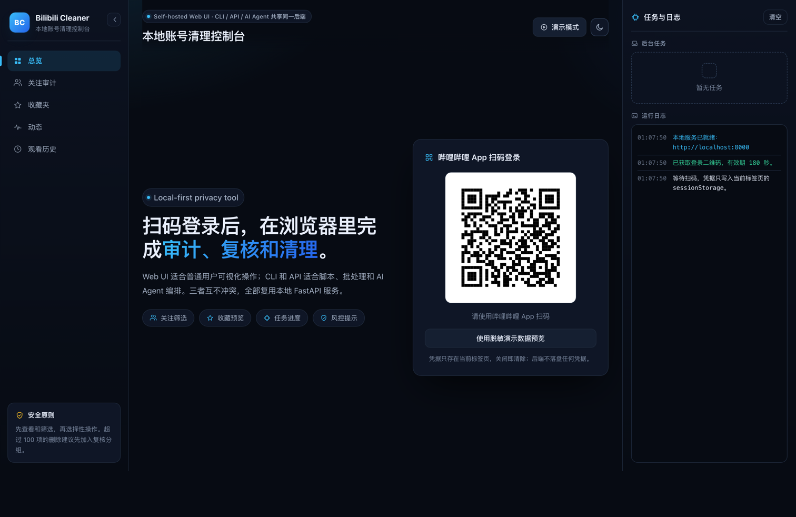
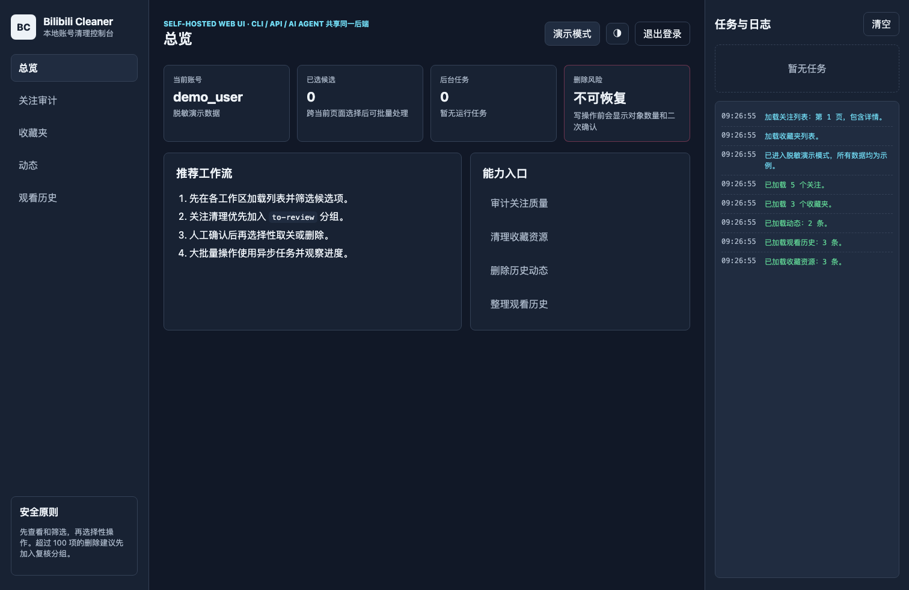
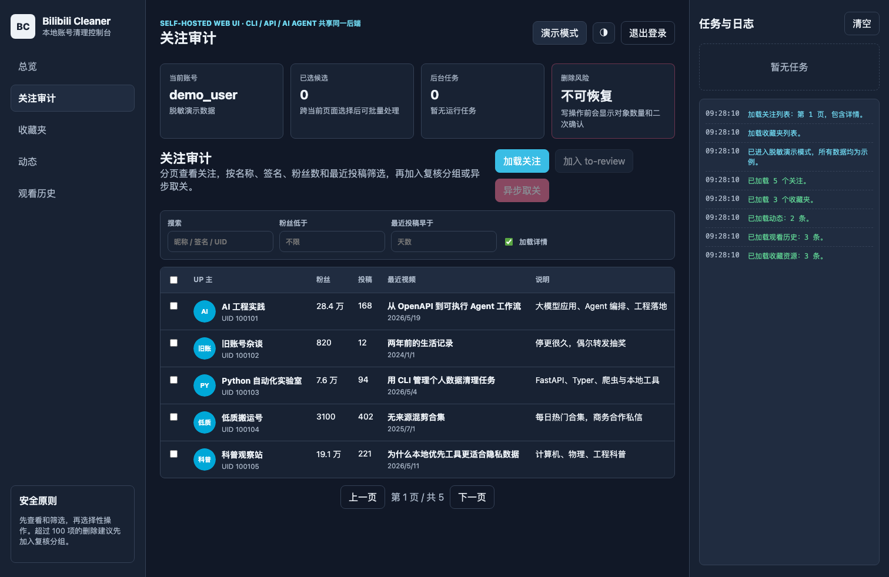

# Bilibili Cleaner · Self-hosted Bilibili Account Cleaner

**Bilibili Cleaner** is an open-source, self-hosted toolkit for inspecting and cleaning a Bilibili account. It provides a local Web UI, FastAPI HTTP API, Python CLI, OpenAPI schema, rate limiting, retry handling, and async tasks for long-running cleanup operations.

中文主文档: [README.md](README.md) · Documentation map: [docs/README.md](docs/README.md) · API reference: [docs/API.md](docs/API.md) · FAQ: [docs/FAQ.md](docs/FAQ.md) · LLM summary: [llms.txt](llms.txt)

## TL;DR

**Bilibili Cleaner is a local-first Bilibili account cleanup workbench.** It turns "list account data -> filter locally -> review manually -> delete selectively" into a Web UI, HTTP API, and CLI. It is useful for Bilibili users cleaning their own accounts, developers building scripts, and AI agents that need a structured OpenAPI-compatible cleanup surface.

## What It Solves

Cleaning a Bilibili account manually is slow: followings, favorites, dynamics, and watch history may require hundreds or thousands of clicks. Closed third-party tools also require trust. This project runs on your own machine and calls Bilibili Web APIs directly from your local environment.

## Who It Is For

- Users preparing to delete or retire a Bilibili account.
- Users cleaning a side account, test account, or old account.
- Developers who need a local API or CLI for Bilibili account cleanup workflows.
- AI agents that need structured listing, enrichment, selective action, and task polling endpoints.

## What To Read

| Goal | Start here |
|---|---|
| Understand the project and run it quickly | [README.md](README.md) or this English README |
| Use HTTP APIs, curl, scripts, or AI agents | [docs/API.md](docs/API.md), [openapi.json](openapi.json), [llms.txt](llms.txt) |
| Troubleshoot login, credentials, rate limits, risk-control responses, or tasks | [docs/FAQ.md](docs/FAQ.md) |
| Navigate the full documentation set | [docs/README.md](docs/README.md) |

## Core Features

- QR-code login with the Bilibili mobile app.
- List followings, enrich them with UP profile/stat/latest-video data, and unfollow selected `mid`s.
- Empty favorite folders or delete selected favorite resources.
- List and delete dynamics, including newer `opus` image-text dynamics via WBI-signed fetches.
- List, delete, or clear watch history.
- Manage Bilibili following groups for safe "tag first, review later, then unfollow" workflows.
- Async task queue for long-running batch operations.
- CLI command `bilibili-cleaner` and canonical `/api/v2/*` HTTP API.
- OpenAPI schema for tool integration and AI-agent consumption.

## Limitations

- Deleted data cannot be recovered. Bilibili has no undo.
- Bilibili has no reliable public API for "list comments I posted", so this project does not delete posted comments.
- Private messages, fans, bangumi follows, and watch-later are outside the current scope.
- Bilibili has no real batch-unfollow endpoint; this project unfollows one account at a time behind a shared `1.5 req/s` in-process rate limit — unfollowing 1600 accounts takes roughly 18 minutes.
- Risk-control responses (`-352`, `-799`, `-509`, HTTP 412/429) are retried with exponential backoff (3 retries, 4 attempts total). Persistent failures mean you should pause, not add workers.
- Task state is in memory. Restarting the service loses task progress, and only the most recent 200 finished tasks are retained.
- The tool only operates on the account that logged in, and does not bypass Bilibili risk control.

## Quick Start

### Docker Compose

```bash
git clone https://github.com/tytsxai/bilibili-cleaner.git
cd bilibili-cleaner
docker compose up -d
```

Open:

```text
http://localhost:8000
```

Stop:

```bash
docker compose down
```

### Python

```bash
git clone https://github.com/tytsxai/bilibili-cleaner.git
cd bilibili-cleaner

python3 -m venv .venv
source .venv/bin/activate

pip install -r backend/requirements.txt
uvicorn backend.main:app --host 0.0.0.0 --port 8000
```

Then open:

- Web UI: `http://localhost:8000`
- Swagger UI: `http://localhost:8000/docs`
- OpenAPI JSON: `http://localhost:8000/openapi.json`

## Web UI Screenshots

The Web UI is a local account cleanup console, not just a set of wipe buttons. It lets regular users scan to log in, preview lists, filter candidates, delete selected items, tag followings for manual review, and watch async task progress. The CLI, HTTP API, and AI-agent workflows continue to share the same backend service layer.

The console is dark by default with a light theme toggle in the top-right corner. The sidebar collapses, and the workspaces, metric cards, and task/log panel reflow on narrow screens.

> Screenshots use sanitized demo data. They do not contain real account IDs, names, cookies, or cleanup records. Open `http://localhost:8000/?demo=1` to explore the same demo mode locally. The QR code in the login screenshot is a placeholder pointing at this repository, not a usable login code.

QR login:



Overview:



Following audit:



## Web UI Workflow

1. Start the service and open `http://localhost:8000`.
2. Scan the QR code with the Bilibili mobile app.
3. Use the Followings, Favorites, Dynamics, and History workspaces to load and review data.
4. Filter and select candidates before running destructive actions.
5. For followings, prefer tagging candidates into `to-review` first, then manually review them in Bilibili before unfollowing.
6. Large unfollow batches run as async tasks and can be tracked in the task panel.
7. Click "logout" when finished to clear credentials from this tab. They live in `sessionStorage`, so closing the tab clears them too.

## CLI

```bash
pip install -e .
bilibili-cleaner auth login
bilibili-cleaner me

bilibili-cleaner followings list --with-detail
bilibili-cleaner followings all
bilibili-cleaner followings unfollow 111 222 333

bilibili-cleaner favorites folders
bilibili-cleaner dynamics list
bilibili-cleaner history list
```

Credentials are stored at `~/.bilibili-cleaner/credentials.json` or can be provided through `BILI_SESSDATA` and `BILI_JCT`.

## API

Recommended endpoints are under `/api/v2/*`.

| Area | Endpoints |
|---|---|
| Identity | `GET /api/v2/me` |
| Users | `GET /api/v2/users/{mid}`, `/stat`, `/videos` |
| Followings | `GET /api/v2/followings`, `POST /api/v2/followings/unfollow`, `POST /api/v2/followings/unfollow-task` |
| Favorites | `GET /api/v2/favorites/folders`, `GET /api/v2/favorites/folders/{id}/items`, `POST /api/v2/favorites/folders/{id}/delete` |
| Dynamics | `GET /api/v2/dynamics`, `POST /api/v2/dynamics/delete` |
| History | `GET /api/v2/history`, `POST /api/v2/history/delete`, `POST /api/v2/history/clear` |
| Relation tags | `GET /api/v2/relation/tags`, `POST /api/v2/relation/tags`, `POST /api/v2/relation/tags/members` |
| Tasks | `GET /api/v2/tasks`, `GET /api/v2/tasks/{id}`, `DELETE /api/v2/tasks/{id}` |

Write requests require:

```text
SESSDATA: <your SESSDATA>
bili_jct: <your bili_jct>
Content-Type: application/json
```

See [docs/API.md](docs/API.md) for curl recipes and cookbook workflows.

## Privacy and Safety

This project is a local tool, not a hosted service. Web credentials are stored in browser `sessionStorage` (cleared when the tab closes), and CLI credentials are stored locally. API calls go from your machine to bilibili.com. Use it only for accounts you own, and review carefully before running destructive operations.

## FAQ

**Is this an official Bilibili tool?**
No. This project has no affiliation with Bilibili. It calls Bilibili's public Web APIs, and you are responsible for complying with the platform's rules.

**Are my credentials sent to a third-party server?**
No. There is no hosted service. The Web UI, backend, and CLI all run on your own machine, and requests go directly from your machine to bilibili.com. Credentials live in browser `sessionStorage` or `~/.bilibili-cleaner/credentials.json`.

**Can it get my account banned?**
The client calls Bilibili at a conservative ~1.5 req/s and retries risk-control responses automatically, so temporary rate limiting is far more likely than a ban. Any bulk automation still carries platform risk — split very large cleanups into batches.

**Can it delete comments I posted?**
No. Bilibili exposes no reliable public API to list your own comments, so they cannot be located and deleted safely.

**Does it handle private messages, fans, bangumi, or watch-later?**
Not currently. Scope is followings, favorite folders, dynamics, and watch history.

**Can it clean someone else's account?**
No. It only operates on the account whose credentials are supplied.

**Why is bulk unfollow slow?**
Bilibili has no batch-unfollow endpoint, so the project calls one `fid` at a time under a shared rate limit.

**Web UI, CLI, or API?**
Use the Web UI to wipe things quickly, the CLI to filter and review before deleting, and `/api/v2/*` with [openapi.json](openapi.json) for scripts and AI agents.

See [docs/FAQ.md](docs/FAQ.md) for troubleshooting details.

## Keywords

Bilibili account cleanup, Bilibili cleaner, Bilibili bulk unfollow, clear Bilibili favorites, delete Bilibili dynamics, clear Bilibili watch history, self-hosted privacy tool, FastAPI Bilibili API, Bilibili CLI, AI agent OpenAPI integration.

## Star History

If this project is useful to you, a star helps others discover it. Star History is only an open-source visibility signal and does not imply any affiliation with Bilibili.

<p align="center">
  <a href="https://star-history.com/#tytsxai/bilibili-cleaner&Date">
    
  </a>
</p>

## License

MIT © 2024-2026. This project is not affiliated with Bilibili.
